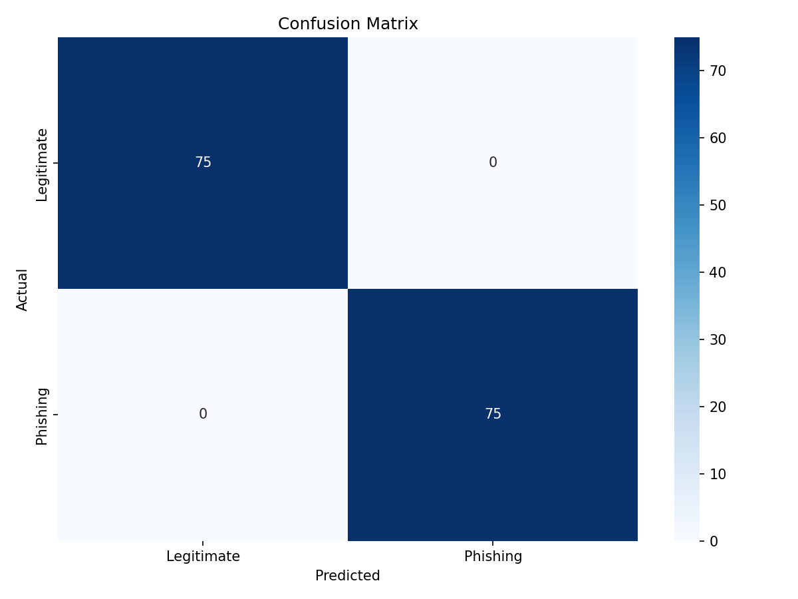
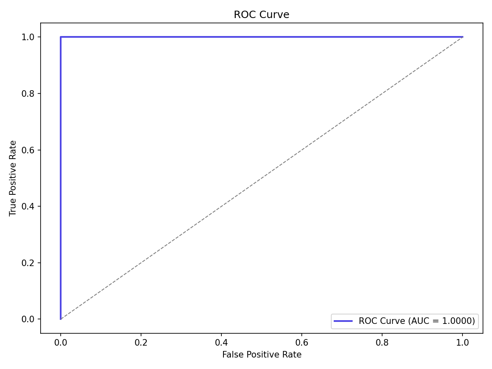
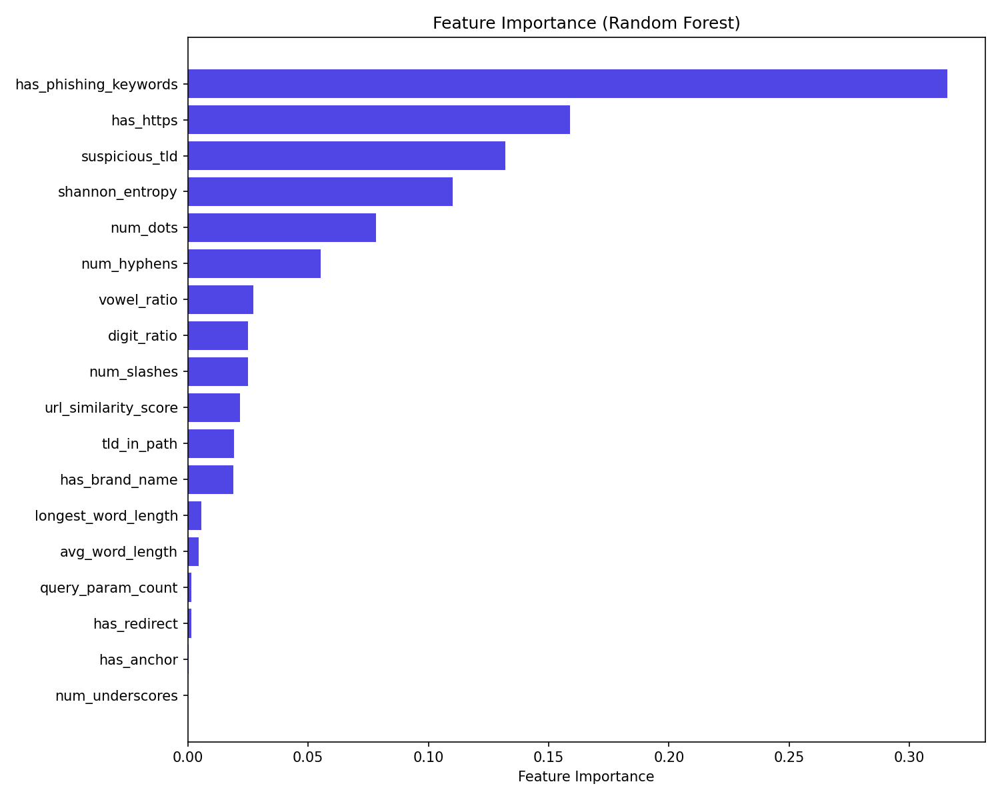
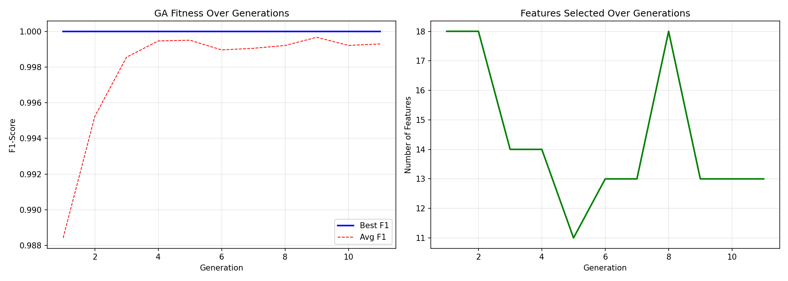

# VIVEKANAND EDUCATION SOCIETY'S INSTITUTE OF TECHNOLOGY

## Department of Computer Engineering

### CA / Mini Project Report

**Project Title:**  
PhishGuard AI: URL Phishing Detection Using Machine Learning, Genetic Algorithm, and QR Scanning

**Under the subject:**  
Artificial Intelligence Mini Project

**Year:** S.E.  
**Semester:** IV

**Submitted by:**  
[Student Name 1 - Roll No.]  
[Student Name 2 - Roll No.]  
[Student Name 3 - Roll No.]  
[Student Name 4 - Roll No.]

**Under the guidance of:**  
[Guide Name]

**Subject Teacher:**  
[Subject Teacher Name]

**Academic Year:**  
2025-2026

---

# Index

1. Title
2. Chapter 1: Introduction
3. Chapter 2: Literature Survey
4. Chapter 3: Requirements
5. Chapter 4: Proposed Design (Block Diagram)
6. Chapter 5: Implementation
7. Chapter 6: Result Analysis
8. Chapter 7: Conclusion
9. References

---

# Chapter 1: Introduction

## 1.1 Background

Phishing is a cyberattack in which an attacker tries to trick a user into opening a fake link or revealing sensitive information such as passwords, OTPs, or banking details. Since URLs are the first visible indicator of many phishing attacks, automatic URL analysis is a practical way to detect threats quickly.

This project, **PhishGuard AI**, is a local phishing URL detection system built using Python and Machine Learning. It extracts numerical features directly from a URL string, applies Genetic Algorithm based feature selection, and classifies the URL using a voting ensemble of Random Forest, XGBoost, and LightGBM. The system also supports QR code scanning so that suspicious URLs hidden inside QR codes can be analyzed.

## 1.2 Problem Statement

Manual inspection of URLs is difficult for normal users, especially when attackers use typo-squatting, suspicious top-level domains, URL shorteners, encoded strings, excessive subdomains, or QR-code based phishing. The goal of this project is to build a fast and practical system that can classify URLs as legitimate or phishing using only locally extracted URL-based features.

## 1.3 Objectives

- To detect phishing URLs using machine learning.
- To extract discriminative lexical, structural, and statistical features from URLs.
- To reduce irrelevant features using a Genetic Algorithm.
- To improve prediction accuracy using a soft voting ensemble.
- To provide a simple web-based interface for end users.
- To support QR-code based URL extraction for detecting quishing attacks.

## 1.4 Scope

The system focuses on URL-based phishing detection and does not rely on external APIs, DNS lookups, or webpage downloads. This keeps the solution lightweight and fast. The current implementation works on a locally prepared dataset of labeled legitimate and phishing URLs and can be extended further with live threat intelligence in future versions.

## 1.5 Project Summary

The repository implements:

- 33 handcrafted URL features.
- A custom Genetic Algorithm for feature selection.
- A voting ensemble using Random Forest, XGBoost, and LightGBM.
- A Flask web application for prediction.
- QR image scanning using OpenCV.
- Evaluation plots such as confusion matrix, ROC curve, GA evolution, and feature importance.

---

# Chapter 2: Literature Survey

The project design is aligned with recent work in phishing URL detection, feature selection, ensemble learning, and QR-code decoding.

| Ref. | Work / Source | Key Idea | Relevance to This Project |
|------|---------------|----------|---------------------------|
| [1] | Kocyigit et al. (2024) | Genetic Algorithm based feature selection helps reduce unnecessary URL features while improving model quality and efficiency. | Supports the use of GA for selecting the most informative phishing features. |
| [2] | MDPI Electronics (2022) | GA-embedded phishing detection shows that evolutionary search is effective for optimizing feature subsets in URL-based detection systems. | Motivates the custom GA used in this system. |
| [3] | Shin et al. (2022) | Heterogeneous ensemble models outperform single models for malicious webpage detection. | Supports using a voting ensemble instead of a single classifier. |
| [4] | scikit-learn RandomForestClassifier documentation | Random forests combine many decision trees to improve predictive accuracy and reduce overfitting. | Used as one of the base learners in the ensemble. |
| [5] | XGBoost Python API documentation | XGBClassifier provides gradient-boosted decision trees suitable for high-performance classification. | Used as the second ensemble member. |
| [6] | LightGBM LGBMClassifier documentation | LightGBM provides efficient gradient boosting on tabular data. | Used as the third ensemble member. |
| [7] | Flask Quickstart documentation | Flask provides simple routing and request handling for web applications. | Used to expose prediction and QR scan APIs. |
| [8] | OpenCV QRCodeDetector documentation | `detectAndDecode()` supports direct QR-code detection and decoding from an input image. | Used for extracting URLs from uploaded QR images. |

## 2.1 Observations from Literature

- URL-based phishing detection remains effective because many phishing attacks reveal suspicious lexical and structural patterns.
- Feature selection is important when many handcrafted URL features are used, because redundant features can increase training cost and reduce generalization.
- Ensemble learning improves robustness because different classifiers capture different aspects of the data.
- QR-based phishing, also called quishing, requires image-based preprocessing before URL classification.

## 2.2 Motivation for the Proposed System

Based on the above findings, this project combines:

- URL feature engineering,
- Genetic Algorithm based feature selection,
- voting ensemble classification,
- and QR-code scanning

into one practical phishing detection pipeline.

---

# Chapter 3: Requirements

## 3.1 Functional Requirements

- The system shall accept a URL entered by the user.
- The system shall extract 33 numerical features from the URL.
- The system shall classify the URL as legitimate or phishing.
- The system shall display confidence score, risk level, and risk factors.
- The system shall allow QR image upload and decode the embedded URL.
- The system shall provide model information and plots through the web app.

## 3.2 Non-Functional Requirements

- The system should run locally without external APIs.
- The interface should be simple and easy to use.
- The prediction process should be fast enough for near real-time use.
- The code should be modular so that the training and web layers remain separate.
- The model should be reproducible using a fixed random seed.

## 3.3 Software Requirements

| Component | Requirement |
|----------|-------------|
| Operating System | Windows / Linux / any Python-supported desktop OS |
| Programming Language | Python 3.x |
| Web Framework | Flask 3.0.0 |
| Data Processing | Pandas 2.1.4, NumPy 1.26.2 |
| Machine Learning | scikit-learn 1.3.2 |
| Boosting Libraries | XGBoost 2.0.3, LightGBM 4.1.0 |
| Visualization | Matplotlib 3.8.2, Seaborn 0.13.0 |
| Model Persistence | joblib 1.3.2 |
| Computer Vision | opencv-python-headless 4.9.0.80 |

## 3.4 Suggested Hardware Requirements

| Component | Suggested Specification |
|----------|--------------------------|
| Processor | Any modern dual-core or better CPU |
| RAM | 4 GB minimum, 8 GB recommended |
| Storage | Around 1 GB free space for code, model, plots, and dataset |
| Internet | Not required for prediction after setup |

## 3.5 Dataset Requirements

The project uses a locally prepared labeled dataset stored in:

- `data/raw/urls.csv`
- `data/processed/features.csv`

Observed dataset details from the repository:

- Total samples: **750**
- Legitimate URLs: **375**
- Phishing URLs: **375**
- Total engineered features: **33**

---

# Chapter 4: Proposed Design (Block Diagram)

## 4.1 System Overview

The proposed system has two user entry points:

1. URL text input
2. QR image upload

If a QR image is uploaded, the system first extracts the hidden URL using OpenCV. The URL is then passed to the same feature extraction and classification pipeline used for normal text input.

## 4.2 Block Diagram

```text
                    +----------------------+
                    |      User Input      |
                    |  URL or QR Image     |
                    +----------+-----------+
                               |
                +--------------+--------------+
                |                             |
                v                             v
      +-------------------+         +-------------------+
      | URL Text Input    |         | QR Image Upload   |
      +-------------------+         +---------+---------+
                                              |
                                              v
                                   +---------------------+
                                   | OpenCV QR Decoder   |
                                   | detectAndDecode()   |
                                   +----------+----------+
                                              |
                                              v
                                   +---------------------+
                                   | Extracted URL Text  |
                                   +----------+----------+
                                              |
                                              v
                                   +---------------------+
                                   | Feature Extraction  |
                                   | 33 URL Features     |
                                   +----------+----------+
                                              |
                                              v
                                   +---------------------+
                                   | GA Selected 18      |
                                   | Important Features  |
                                   +----------+----------+
                                              |
                                              v
                                   +---------------------+
                                   | StandardScaler      |
                                   +----------+----------+
                                              |
                                              v
                                   +---------------------+
                                   | Voting Ensemble     |
                                   | RF + XGB + LGBM     |
                                   +----------+----------+
                                              |
                                              v
                                   +---------------------+
                                   | Prediction Result   |
                                   | Risk Level + Factors|
                                   +---------------------+
```

## 4.3 GA Configuration Used

| Parameter | Value |
|----------|-------|
| Population Size | 40 |
| Maximum Generations | 30 |
| Crossover Rate | 0.8 |
| Mutation Rate | 0.03 |
| Tournament Size | 5 |
| Elitism Count | 2 |
| Minimum Features | 5 |
| CV Folds | 5 |
| Early Stop Patience | 10 |
| Random Seed | 42 |

## 4.4 Feature Selection Outcome

The GA selected **18 out of 33** engineered features:

- `num_dots`
- `num_hyphens`
- `num_underscores`
- `num_slashes`
- `digit_ratio`
- `has_https`
- `suspicious_tld`
- `has_phishing_keywords`
- `has_brand_name`
- `shannon_entropy`
- `vowel_ratio`
- `longest_word_length`
- `avg_word_length`
- `has_redirect`
- `has_anchor`
- `query_param_count`
- `tld_in_path`
- `url_similarity_score`

---

# Chapter 5: Implementation

## 5.1 Dataset Preparation

The dataset preparation logic is implemented in `data/download_datasets.py`. The script:

- stores curated legitimate URLs,
- stores curated phishing URLs,
- generates additional synthetic variations,
- balances both classes,
- saves labeled URLs to `data/raw/urls.csv`,
- extracts URL features and saves them to `data/processed/features.csv`.

## 5.2 Feature Engineering

Feature extraction is implemented in `src/feature_engineering.py`. The system computes 33 features grouped into:

- Lexical features: URL length, dots, hyphens, digits, special characters
- Structural features: HTTPS usage, port usage, redirects, subdomains
- Suspicion indicators: phishing keywords, suspicious TLDs, URL shorteners
- Statistical features: entropy, vowel ratio, consonant ratio
- Brand similarity features: edit-distance style similarity to known brands

This design allows the system to work offline without fetching webpage content.

## 5.3 Genetic Algorithm Module

The custom GA is implemented in `src/genetic_algorithm.py`. Each chromosome is a binary mask over the 33 features:

- `1` means the feature is selected
- `0` means the feature is dropped

The fitness value is the mean cross-validated F1-score of a Random Forest classifier. The algorithm uses:

- random initialization,
- tournament selection,
- single-point crossover,
- bit-flip mutation,
- elitism,
- and early stopping.

Observed training output from the saved model metadata:

- Best GA fitness: **1.0000**
- Total GA time: **318.7 seconds**
- Generations completed before early stopping: **11**

## 5.4 Model Training

The training pipeline is implemented in `src/train.py`. The steps are:

1. Load processed features.
2. Split the dataset using an 80:20 stratified split.
3. Run the Genetic Algorithm on the training set.
4. Select only the GA-approved features.
5. Standardize the selected features.
6. Train a soft voting ensemble using Random Forest, XGBoost, and LightGBM.
7. Evaluate the model.
8. Save the trained model and metadata to `models/model.pkl`.

## 5.5 Prediction Module

Prediction logic is implemented in `src/predict.py`. For each input URL, the module:

- performs basic pre-validation,
- extracts features,
- selects GA-approved features,
- scales the feature vector,
- predicts phishing probability,
- maps the score to a risk level,
- and generates human-readable risk factors.

Risk labels used in the project:

- Safe
- Low Risk
- Medium Risk
- High Risk
- Dangerous

## 5.6 QR Scanner Module

QR scanning is implemented in `src/qr_scanner.py` using OpenCV. The uploaded image bytes are converted into a NumPy array, decoded into an image matrix, and then passed to `cv2.QRCodeDetector().detectAndDecode()` to extract the URL.

## 5.7 Web Application

The Flask server is implemented in `app/app.py` and provides:

- `/` for the interface,
- `/predict` for URL classification,
- `/scan-qr` for QR-image scanning,
- `/model-info` for metadata,
- `/plots/<filename>` for result plots.

## 5.8 Major Files in the Project

| File | Purpose |
|------|---------|
| `data/download_datasets.py` | Dataset creation and feature CSV generation |
| `src/feature_engineering.py` | Extracts 33 URL features |
| `src/genetic_algorithm.py` | Custom feature-selection GA |
| `src/train.py` | Full training and evaluation pipeline |
| `src/predict.py` | Single URL inference logic |
| `src/qr_scanner.py` | QR URL extraction |
| `app/app.py` | Flask backend |
| `app/templates/index.html` | Web interface markup |
| `app/static/style.css` | UI styling |
| `app/static/script.js` | Frontend interactions |

---

# Chapter 6: Result Analysis

## 6.1 Experimental Setup

The saved model and processed dataset show the following evaluation setup:

- Total dataset size: **750**
- Train set size: **600**
- Test set size: **150**
- Split strategy: **80:20 stratified split**
- Random state: **42**

## 6.2 Evaluation Metrics

Saved model metrics:

| Metric | Value |
|--------|-------|
| Accuracy | 1.0000 |
| Precision | 1.0000 |
| Recall | 1.0000 |
| F1-Score | 1.0000 |
| ROC-AUC | 1.0000 |

## 6.3 Confusion Matrix

Observed confusion matrix on the test set:

| Actual / Predicted | Legitimate | Phishing |
|--------------------|------------|----------|
| Legitimate | 75 | 0 |
| Phishing | 0 | 75 |

This means the saved model correctly classified all 150 test samples in the available evaluation split.

## 6.4 Example Prediction Behavior

| Test URL | Predicted Class | Risk Level | Phishing Probability |
|----------|-----------------|------------|----------------------|
| `https://www.google.com` | Legitimate | Safe | 0.04% |
| `http://paypal-secure-login.tk/verify` | Phishing | Dangerous | 99.98% |
| `http://www.google.com@evil.com/login` | Phishing | Dangerous | 93.57% |

Example risk factors generated by the model include:

- Suspicious TLD detected
- Contains phishing keywords
- No HTTPS encryption
- Contains `@` symbol
- Double-slash redirect
- Visually similar to a known brand domain

## 6.5 Generated Evaluation Plots

### Confusion Matrix



### ROC Curve



### Feature Importance



### GA Evolution



## 6.6 Interpretation

- The project achieved perfect performance on the available held-out split.
- The GA reduced the feature set from 33 to 18 features, which simplifies inference.
- Ensemble classification improved robustness by combining different tree-based learners.
- The plots generated in the repository support the saved evaluation metrics.

## 6.7 Screenshots / Photos of Project

Faculty templates often ask for screenshots of the running system. The repository currently includes evaluation plots but not browser screenshots. The following can be added manually if needed before final submission:

- Home page of the web application
- URL scan result page
- QR scan input and output page
- Model information dashboard view

---

# Chapter 7: Conclusion

PhishGuard AI is a practical phishing URL detection system that combines feature engineering, Genetic Algorithm based feature selection, ensemble learning, and a web interface into one complete workflow. The project successfully demonstrates how lexical and structural URL analysis can be used to detect phishing attempts without depending on external services.

The saved model metadata shows excellent results on the current evaluation split, with accuracy, precision, recall, F1-score, and ROC-AUC all equal to 1.0000. In addition, the QR scanning module extends the system beyond plain text URLs and makes it relevant for modern quishing threats.

## 7.1 Limitations

- The current dataset is locally curated and partly synthetic.
- The evaluation is based on the dataset available in the repository only.
- No live blacklist, WHOIS, DNS, or webpage HTML features are used.

## 7.2 Future Scope

- Use larger real-world phishing datasets.
- Add domain age, WHOIS, and DNS-based features.
- Add live browser extension or email plugin integration.
- Include explainable AI visualizations for feature contributions.
- Extend QR analysis to detect multiple QR codes in one image.

---

# References

[1] Emre Kocyigit, Mehmet Korkmaz, Ozgur Koray Sahingoz, and Banu Diri, "Enhanced Feature Selection Using Genetic Algorithm for Machine-Learning-Based Phishing URL Detection," *Applied Sciences*, 2024.  
https://www.mdpi.com/2867520

[2] "Optimized URL Feature Selection Based on Genetic-Algorithm-Embedded Deep Learning for Phishing Website Detection," *Electronics*, MDPI, 2022.  
https://www.mdpi.com/2079-9292/11/7/1090

[3] Sam-Shin Shin, Seung-Goo Ji, and Sung-Sam Hong, "A Heterogeneous Machine Learning Ensemble Framework for Malicious Webpage Detection," *Applied Sciences*, 2022.  
https://www.mdpi.com/2076-3417/12/23/12070

[4] scikit-learn documentation, "RandomForestClassifier".  
https://scikit-learn.org/stable/modules/generated/sklearn.ensemble.RandomForestClassifier.html

[5] XGBoost documentation, "Python API Reference - XGBClassifier".  
https://xgboost.readthedocs.io/en/stable/python/python_api.html#xgboost.XGBClassifier

[6] LightGBM documentation, "lightgbm.LGBMClassifier".  
https://lightgbm.readthedocs.io/en/stable/pythonapi/lightgbm.LGBMClassifier.html

[7] Flask documentation, "Quickstart".  
https://flask.palletsprojects.com/en/2.2.x/quickstart/

[8] OpenCV documentation, "QRCodeDetector".  
https://docs.opencv.org/3.4/javadoc/org/opencv/objdetect/QRCodeDetector.html
